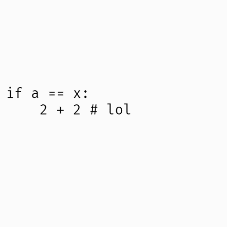

# Bicycle Repair Man

BRM is a python source modification library to perform lossless modifications with the guarantee of full-roundtripability. It is
generally used for unstructured source parts, where the modification can be done directly on the tokens.

A simple example would be the `TokenTransformer`, where we change each `+` (plus) operator
to a `-` (minus) operator.

```py
class DestoryAllOfThem(TokenTransformer):
    
    # Replace each PLUS token with a MINUS
    def visit_plus(self, token):
        return token._replace(string="-")

transformer = DestoryAllOfThem()
assert transformer.transform("(2p) + 2 # with my precious comment") == "(2p) - 2 # with my precious comment"
```

One advantage of token based refactoring over any form of structured tree representation is that, you are much more
liberal about what you can do. Do you want to prototype a new syntax idea, for example a `√` operator; here you go:

```py
class SquareRoot(TokenTransformer):

    # Register a new token called `squareroot`
    def register_squareroot(self):
        return "√"

    # Match a squareroot followed by a number
    @pattern("squareroot", "number")
    def remove_varprefix(self, operator, token):
        return self.quick_tokenize(f"int({token.string} ** 0.5)")

sqr = SquareRoot()
assert eval(sqr.transform("√9")) == 3
```

## Why BRM

- BRM is an extremely simple, dependency-free, pure-python tool with 500 LoC that you can easily vendor.
- BRM supports each new Python syntax out of the box, no need to wait changes on our upstream.
- BRM supports incomplete files (and files that contain invalid python syntax).
- BRM supports introducing new syntax and making it permanent for prototypes.

If you need any of these, BRM might be the right fit. But I would warn against using it for complex
refactoring tasks, since that is not a problem we intend to tackle. If you need such a tool, take a look
at [refactor](https://github.com/isidentical/refactor) or [parso](https://github.com/davidhalter/parso).

## Permanency

If you loved the concept of transformers and use them in real world code, BRM exposes a custom
encoding that will run your transformers automatically when specified.

- Write a transformer
- Copy it to the `~/.brm` folder, or simply use `cp <file>.py $(python -m brm)`
- Specify `# coding: brm` on each file

Example:

```py
from brm import TokenTransformer, pattern

class AlwaysTrue(TokenTransformer):

    STRICT = False

    # Make every if/elif statement `True`
    @pattern("name", "*any", "colon")
    def always_true_if(self, *tokens):
        statement, *_, colon = tokens
        if statement.string not in {"if", "elif"}:
            return
        true, = self.quick_tokenize("True")
        return (statement, true, colon)

```

Let's put our transformer to the BRM's transformer folder, and run our example.

```
(.venv) [  9:12ÖS ]  [ isidentical@x200:~ ]
 $ cat -n r.py
     1  # coding: brm
     2
     3  a = 2
     4  if a > 2:
     5      print("LOL")
(.venv) [  9:12ÖS ]  [ isidentical@x200:~ ]
 $ cp test.py $(python -m brm)
(.venv) [  9:12ÖS ]  [ isidentical@x200:~ ]
 $ python r.py
LOL
```

TA-DA!

# BRM Pattern Syntax

For BRM, a python source code is just a sequence of tokens. It doesn't create any relationships between them,
or even verify the file is syntactically correct. For example take a look at the following file:

```py
if a == x:
    2 + 2 # lol
```

For BRM, in an abstract fashion, the file is just the following text:

```
NAME NAME EQEQUAL NAME COLON NEWLINE INDENT NUMBER PLUS NUMBER COMMENT NEWLINE DEDENT ENDMARKER
```

And internally it is processed like this:



If you want to match binary plus operation here (`2 + 2`), you can create pattern with `number, plus, name`.

> Note: If you want to visualize your patterns and see what they match, give [`examples/visualize.py`](./examples/visualize.py) a shot.

# Extras

If you are using the `TokenTransformer`, there are a few handy functions that you might check out:

| Function                                                           | Returns               | Description                                                                                                                                                                                                                 |     |
| ------------------------------------------------------------------ | --------------------- | --------------------------------------------------------------------------------------------------------------------------------------------------------------------------------------------------------------------------- | --- |
| `quick_tokenize(source: str, *, strip: bool = True)`               | `List[TokenInfo]`     | Break the given `source` text into a list of tokens. If `strip` is `True`, then the last 2 tokens (`NEWLINE`, `EOF`) will be omitted.                                                                                       |     |
| `quick_untokenize(tokens: List[TokenInfo])`                        | `str`                 | Convert the given sequence of `tokens` back to a representation which would yield the same tokens back when tokenized (a lossy conversion). If you want a full round-trip / lossless conversion, use `tokenize.untokenize`. |     |
| `directional_length(tokens: List[TokenInfo])`                      | `int`                 | Calculate the linear distance between the first and the last token of the sequence.                                                                                                                                         |     |
| `shift_all(tokens: List[TokenInfo], x_offset: int, y_offset: int)` | `List[TokenInfo]`     | Shift each token in the given sequence by `x_offset` in the column offsets, and by `y_offset` in the line numbers. Return the new list of tokens.                                                                           |     |
| `until(toktype: int, stream: List[TokenInfo])`                     | `Iterator[TokenInfo]` | Yield all tokens until a token of `toktype` is seen. If there are no such tokens seen, it will raise a `ValueError`                                                                                                         |     |
| `_get_type(token: TokenInfo)`                                      | `int`                 | Return the type of the given token. Useful with `until()`. (`internal`)                                                                                                                                                     |     |
